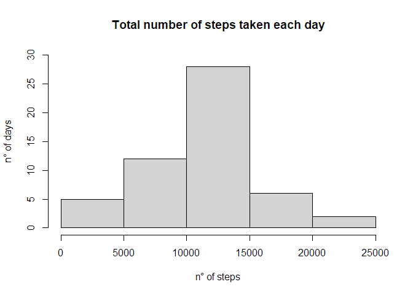
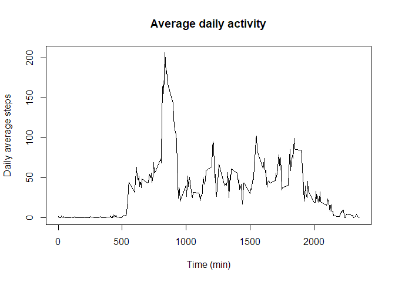
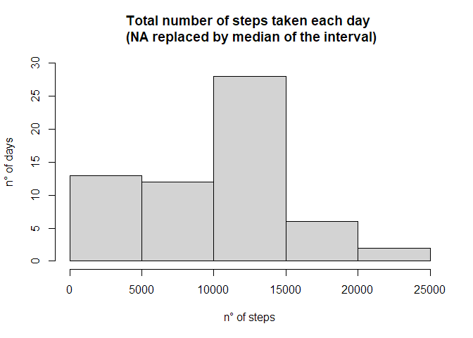
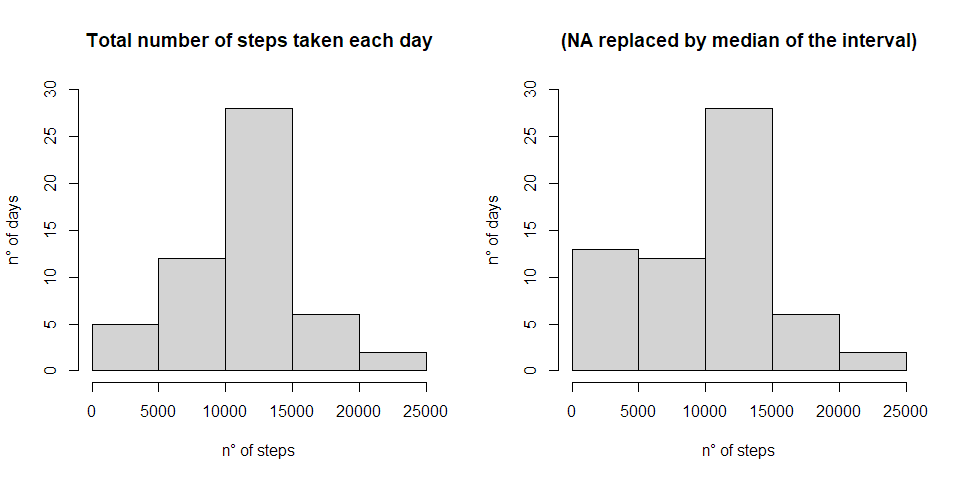
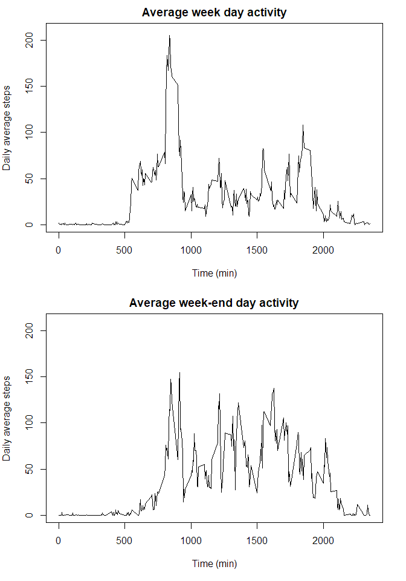

## Loading and preprocessing the data

Zip file is available from course repo and so project folder
First step is to identify and unzip data file. 


```r
list.files()
```

```
## [1] "activity.zip"                  "doc"                          
## [3] "instructions_fig"              "PA1_template.Rmd"             
## [5] "README.md"                     "RepData_PeerAssessment1.Rproj"
```

```r
unzip("activity.zip")
```

Second one is to identify and read csv to store data.


```r
list.files()
```

```
## [1] "activity.csv"                  "activity.zip"                 
## [3] "doc"                           "instructions_fig"             
## [5] "PA1_template.Rmd"              "README.md"                    
## [7] "RepData_PeerAssessment1.Rproj"
```

```r
data <- read.csv("activity.csv", na.strings = "NA")
```

## What is mean total number of steps taken per day?

1. Calculate the total number of steps taken per day
Sum of steps is calculated with data grouped by day (date).
Column are renamed and date convert to date class for further use.


```r
steps_day <- aggregate(steps ~ date, data = data, sum)
steps_day
```

```
##          date steps
## 1  2012-10-02   126
## 2  2012-10-03 11352
## 3  2012-10-04 12116
## 4  2012-10-05 13294
## 5  2012-10-06 15420
## 6  2012-10-07 11015
## 7  2012-10-09 12811
## 8  2012-10-10  9900
## 9  2012-10-11 10304
## 10 2012-10-12 17382
## 11 2012-10-13 12426
## 12 2012-10-14 15098
## 13 2012-10-15 10139
## 14 2012-10-16 15084
## 15 2012-10-17 13452
## 16 2012-10-18 10056
## 17 2012-10-19 11829
## 18 2012-10-20 10395
## 19 2012-10-21  8821
## 20 2012-10-22 13460
## 21 2012-10-23  8918
## 22 2012-10-24  8355
## 23 2012-10-25  2492
## 24 2012-10-26  6778
## 25 2012-10-27 10119
## 26 2012-10-28 11458
## 27 2012-10-29  5018
## 28 2012-10-30  9819
## 29 2012-10-31 15414
## 30 2012-11-02 10600
## 31 2012-11-03 10571
## 32 2012-11-05 10439
## 33 2012-11-06  8334
## 34 2012-11-07 12883
## 35 2012-11-08  3219
## 36 2012-11-11 12608
## 37 2012-11-12 10765
## 38 2012-11-13  7336
## 39 2012-11-15    41
## 40 2012-11-16  5441
## 41 2012-11-17 14339
## 42 2012-11-18 15110
## 43 2012-11-19  8841
## 44 2012-11-20  4472
## 45 2012-11-21 12787
## 46 2012-11-22 20427
## 47 2012-11-23 21194
## 48 2012-11-24 14478
## 49 2012-11-25 11834
## 50 2012-11-26 11162
## 51 2012-11-27 13646
## 52 2012-11-28 10183
## 53 2012-11-29  7047
```

2. Make a histogram of the total number of steps taken each day


```r
hist(steps_day$steps, xlab="n° of steps", ylim = c(0,30), ylab = "n° of days", main = "Total number of steps taken each day")
```

<!-- -->

3. Calculate and report the mean and median of the total number of steps taken per day


```r
summary(steps_day$steps)
```

```
##    Min. 1st Qu.  Median    Mean 3rd Qu.    Max. 
##      41    8841   10765   10766   13294   21194
```

## What is the average daily activity pattern?

1. Make a time series plot (i.e. type = "l") of the 5-minute interval (x-axis) and the average number of steps taken, averaged across all days (y-axis)


```r
steps_interval <- aggregate(steps ~ interval, data = data, mean)
```


```r
plot(x = steps_interval$interval, y = steps_interval$steps, 
     type = "l",
     ylab = "Daily average steps",
     xlab = "Time (min)",
     main = "Average daily activity")
```

<!-- -->

2. Which 5-minute interval, on average across all the days in the dataset, contains the maximum number of steps?


```r
steps_interval[which.max(steps_interval$steps),]
```

```
##     interval    steps
## 104      835 206.1698
```

## Imputing missing values

1. Calculate and report the total number of missing values in the dataset (i.e. the total number of rows with NAs)


```r
summary(data$steps)
```

```
##    Min. 1st Qu.  Median    Mean 3rd Qu.    Max.    NA's 
##    0.00    0.00    0.00   37.38   12.00  806.00    2304
```

```r
sum(is.na(data$steps))
```

```
## [1] 2304
```

2. Devise a strategy for filling in all of the missing values in the dataset. The strategy does not need to be sophisticated. For example, you could use the mean/median for that day, or the mean for that 5-minute interval, etc.

We will use the median of the corresponding interval in order to fill missing           values in the new dataset with the most probable value for the interval. 

3. Create a new dataset that is equal to the original dataset but with the missing data filled in.


```r
data2 <- data
for(i in 1:nrow(data2)){
      if (is.na(data2[i, "steps"])){
            Interval_i <- data2[i, "interval"]
            NA_val <- median(data2[data2$interval== Interval_i, "steps"], na.rm = TRUE)
            data2[i, "steps"] <- NA_val
      } 
}
```

4. Make a histogram of the total number of steps taken each day and Calculate and report the mean and median total number of steps taken per day. Do these values differ from the estimates from the first part of the assignment? 
What is the impact of imputing missing data on the estimates of the total daily number of steps?


```r
steps_day2 <- aggregate(steps ~ date, data = data2, sum)
steps_day2
```

```
##          date steps
## 1  2012-10-01  1141
## 2  2012-10-02   126
## 3  2012-10-03 11352
## 4  2012-10-04 12116
## 5  2012-10-05 13294
## 6  2012-10-06 15420
## 7  2012-10-07 11015
## 8  2012-10-08  1141
## 9  2012-10-09 12811
## 10 2012-10-10  9900
## 11 2012-10-11 10304
## 12 2012-10-12 17382
## 13 2012-10-13 12426
## 14 2012-10-14 15098
## 15 2012-10-15 10139
## 16 2012-10-16 15084
## 17 2012-10-17 13452
## 18 2012-10-18 10056
## 19 2012-10-19 11829
## 20 2012-10-20 10395
## 21 2012-10-21  8821
## 22 2012-10-22 13460
## 23 2012-10-23  8918
## 24 2012-10-24  8355
## 25 2012-10-25  2492
## 26 2012-10-26  6778
## 27 2012-10-27 10119
## 28 2012-10-28 11458
## 29 2012-10-29  5018
## 30 2012-10-30  9819
## 31 2012-10-31 15414
## 32 2012-11-01  1141
## 33 2012-11-02 10600
## 34 2012-11-03 10571
## 35 2012-11-04  1141
## 36 2012-11-05 10439
## 37 2012-11-06  8334
## 38 2012-11-07 12883
## 39 2012-11-08  3219
## 40 2012-11-09  1141
## 41 2012-11-10  1141
## 42 2012-11-11 12608
## 43 2012-11-12 10765
## 44 2012-11-13  7336
## 45 2012-11-14  1141
## 46 2012-11-15    41
## 47 2012-11-16  5441
## 48 2012-11-17 14339
## 49 2012-11-18 15110
## 50 2012-11-19  8841
## 51 2012-11-20  4472
## 52 2012-11-21 12787
## 53 2012-11-22 20427
## 54 2012-11-23 21194
## 55 2012-11-24 14478
## 56 2012-11-25 11834
## 57 2012-11-26 11162
## 58 2012-11-27 13646
## 59 2012-11-28 10183
## 60 2012-11-29  7047
## 61 2012-11-30  1141
```

```r
hist(steps_day2$steps, xlab="n° of steps", ylim = c(0,30), ylab = "n° of days", main = "Total number of steps taken each day \n (NA replaced by median of the interval)")
```

<!-- -->

```r
summary(steps_day2$steps)
```

```
##    Min. 1st Qu.  Median    Mean 3rd Qu.    Max. 
##      41    6778   10395    9504   12811   21194
```

```r
summary(steps_day$steps)
```

```
##    Min. 1st Qu.  Median    Mean 3rd Qu.    Max. 
##      41    8841   10765   10766   13294   21194
```


```r
par(mfrow=c(1,2))
hist(steps_day$steps, xlab="n° of steps", ylim = c(0,30), ylab = "n° of days", main = "Total number of steps taken each day")
hist(steps_day2$steps, xlab="n° of steps", ylim = c(0,30), ylab = "n° of days", main = "(NA replaced by median of the interval)")
```

<!-- -->

## Are there differences in activity patterns between weekdays and weekends?

1. Create a new factor variable in the dataset with two levels – “weekday” and “weekend” indicating whether a given date is a weekday or weekend day.

My setup is in French so i added this code to switch in English in order to use a widely usable code.


```r
Sys.setlocale("LC_ALL", "English")
```

```
## [1] "LC_COLLATE=English_United States.1252;LC_CTYPE=English_United States.1252;LC_MONETARY=English_United States.1252;LC_NUMERIC=C;LC_TIME=English_United States.1252"
```


```r
data2_wd <- data2
data2_wd$week <- weekdays(as.Date(data2_wd$date))

data2_wd[data2_wd$week != "Saturday"& data2_wd$week !="Sunday", "week"] <- "weekday"
data2_wd[data2_wd$week == "Saturday"|data2_wd$week == "Sunday", "week"] <- "weekend"
```

2. Make a panel plot containing a time series plot (i.e. type = "l") of the 5-minute interval (x-axis) and the average number of steps taken, averaged across all weekday days or weekend days (y-axis). See the README file in the GitHub repository to see an example of what this plot should look like using simulated data.


```r
#intervals for week days
steps_interval_wd <- aggregate(steps ~ interval, data = data2_wd[data2_wd$week=="weekday",], mean)

#intervals for week-end days
steps_interval_we <- aggregate(steps ~ interval, data = data2_wd[data2_wd$week=="weekend",], mean)
```


```r
par(mfrow=c(2,1))
par(mar = c(5,4,2,2))

#plot for week days
plot(x = steps_interval_wd$interval, y = steps_interval_wd$steps, 
     type = "l",
     ylim = c(0,210),
     ylab = "Daily average steps",
     xlab = "Time (min)",
     main = "Average week day activity")

#plot for week-end days
plot(x = steps_interval_we$interval, y = steps_interval_we$steps, 
     type = "l",
     ylim = c(0,210),
     ylab = "Daily average steps",
     xlab = "Time (min)",
     main = "Average week-end day activity")
```

<!-- -->
